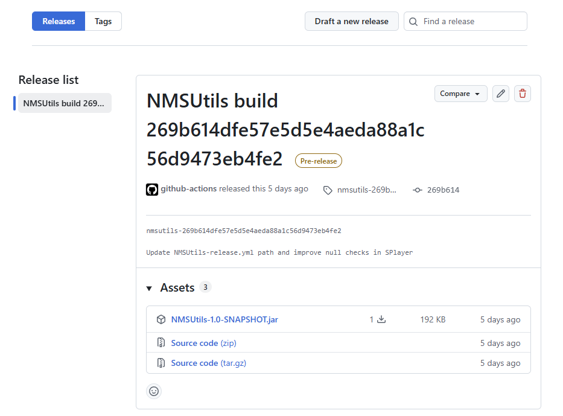
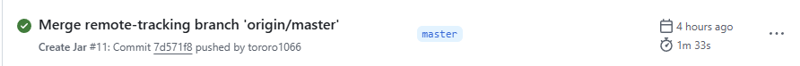
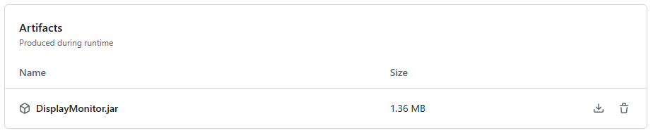

# プラグインの導入

DisplayMonitorを動かす上で必要なプラグインを入れましょう

## NMSUtils
DisplayMonitorを動かす上で必須です\
[ここ](https://github.com/tororo1066/TororoPluginAPI/releases)
から一番上の**NMSUtils build #数字** と書かれた項目の**Assets**を開き、\
**NMSUtils-1.0-SNAPSHOT.jar**をダウンロードしてください\
\
\
pluginsフォルダに入れましょう

## DisplayMonitor
[ここ](https://github.com/tororo1066/DisplayMonitor/actions)から
**Create Jar #数字** と書かれた項目を選択し、\
\
\
下にある**Artifacts**から\
**DisplayMonitor.jar**をダウンロードしてください\
\
こちらも同じようにpluginsフォルダに入れましょう

